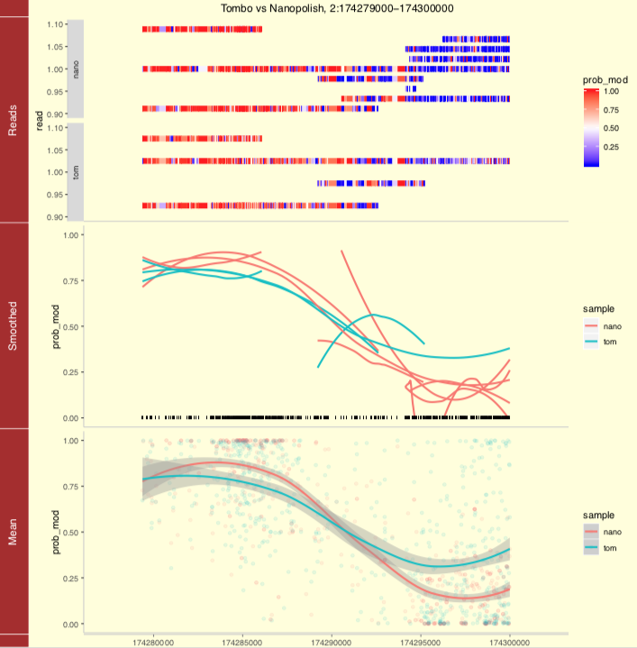
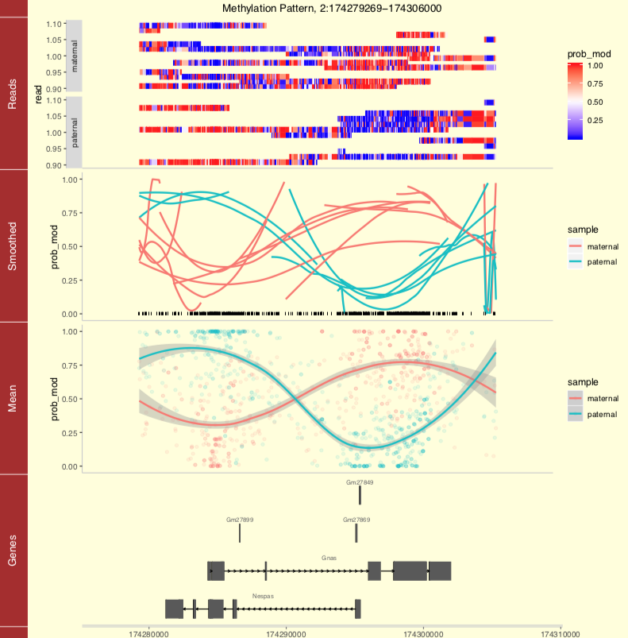
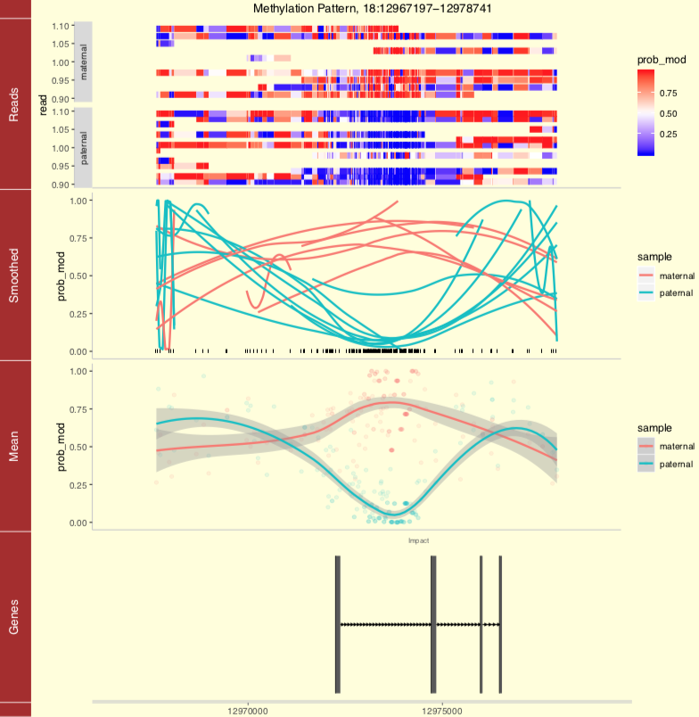

# modRegion
 A tool to quickly access, query and merge per-read base modification results from different software tools
 
 ```bash
./modRegion.R --help
# modRegion
# A tool to quickly access, query and merge per-read base modification results from different software tools.
# 
# Usage:
#   modRegion.R extract (-r=<region> | -f=<regions_txt>)... (-o=<output> | -p=<plot_file> [--title=<title>])... \
# [--nanopolish <[label:]file>]... [--tombo <[label:]file>]... [--deepsignal <[label:]file>]...
#
#   modRegion.R overlap (-o=<output> | -p=<plot_file> [--title=<title>])... [--overhang <overhang>] \
# [--gene_name <gene_name>]... [--gene_biotype <gene_biotype>]... [-r=<region> | -f=<regions_txt>]... \
# [--nanopolish <[label:]file>]... [--tombo <[label:]file>]... [--deepsignal <[label:]file>]... --gtf=<gtf_file>
#
#   modRegion.R plot [--gtf=<gtf_file>] (-r=<region> | -f=<regions_txt>)... -p=<plot_file> <mod_file>...
#   modRegion.R --help
# 
# Options:
#   -h --help  Show this screen.
#   -r --region=<region>  Genomic region in UCSC/IGV/samtools format, eg "chr9:3500-4500", can be given multiple times.
#   -f --regions_file=<regions_txt>  File containing genomic regions (one per line).
#   --nanopolish <[label:]file>  Nanopolish methylation data and (optional) label name.
#   --tombo <[label:]file>  Tombo methylation data and (optional) label name.
#   --deepsignal <[label:]file>  DeepSignal methylation data and (optional) label name.
#   -o --output=<output>  Save dataframe to .tsv or .tsv.gz file.
#   -p --plot_file=<plot_file>  Save plot(s) to pdf.
#   --gtf <gtf_file>  Gene Transfer Format that contains gene informations.
#   --gene_name <gene_name>  Name of the gene, can be given multiple times.
#   --gene_biotype <gene_biotype>  Biotype of gene, eg "protein_coding", can be given multiple times. [default: protein_coding]
#   --overhang <overhang>  Up to how many bases up and downstream from gene. [default: 2000]
#   --title=<title>  Title of the plot.
# 
# Argument:
#   mod_file  Modification .tsv or .tsv.gz file filtered with modRegion.
 ```
## Notes
The motivation is that we are interested in fast querying output statistics over range of genomic positions at the single read resolution, and want to be able to have a common interface and coherent way of accessing the information as well as to save space on disk and on RAM.

This tool is primarily written to quickly extract regional methylation statistics from tsv outputted from methylation callers and it now supports: **[nanopolish](https://github.com/jts/nanopolish)**, **[tombo](https://github.com/nanoporetech/tombo)** and **[deepsignal](https://github.com/bioinfomaticsCSU/deepsignal)**.

It now has the following features:
   * **extract** - pulls out statistics in the region(s) supplied from one or more base modification tsvs
   * **overlap** - finds statistics within ±*overhang* bases of genes
   * **plot** - accepts filtered output and plots

## Dependencies
   - [tidyverse](https://www.tidyverse.org/)
   - [vroom](https://github.com/r-lib/vroom)
   - [docopt](https://github.com/docopt/docopt.R)
   - [rtracklayer](https://rdrr.io/bioc/rtracklayer/)
   - [ggbio](https://rdrr.io/bioc/ggbio/)
   - [data.table](https://github.com/Rdatatable/data.table/wiki)
   
## Example data
Example data can be found the under `test/` folder.

## Usage
### 1. extract
Thanks to [vroom](https://github.com/r-lib/vroom), modRegion builds index to the tsv without loading it entirely to the RAM. This is ideal when the tsv is large and only certain parts of genome are of interest. Users can select either to `-o` output the results as tsv or `-p` plot the regions or both. 

modRegion can work with and write to compressed tsv freely.
```bash
./modRegion.R extract -r "NC_001144.5:430000-470000" \
  --deepsignal test/small_deepsignal.tsv.gz \
  -o test/small_deepsignal.extracted.tsv.gz \
  -p test/small_deepsignal.plots.pdf
```

| sample   | seqname     | pos    | read_id                              | strand | log_lik_ratio | prob_mod | 
|----------|-------------|--------|--------------------------------------|--------|---------------|----------| 
| sample_1 | NC_001144.5 | 462607 | 5535970a-66a3-4f45-a391-1386afbad4f9 | +      | 0.2734        | 0.4321   | 
| sample_1 | NC_001144.5 | 462653 | 5535970a-66a3-4f45-a391-1386afbad4f9 | +      | 3.058         | 0.04486  | 
| sample_1 | NC_001144.5 | 462655 | 5535970a-66a3-4f45-a391-1386afbad4f9 | +      | 3.126         | 0.04205  | 


Users can give multiple `-r` or `-f` options in order to query into multiple regions. It is also possible to provide multiple input files from any supported callers, each with an optional label name as shown below. The program with merge the results into one single dataframe and plot as different samples.

```bash
./modRegion.R extract -r "7:6724000-6736000" -r "2:174279000-174300000" \
  --nanopolish nano:test/paternal.nanopolish.tsv.gz \
  --tombo tom:test/paternal.tombo.tsv.gz \
  -o test/nanotom.extracted.tsv.gz \
  -p test/nanotom.plots.pdf \
  --title "Tombo vs Nanopolish"
```                                               

Tsv returned will have the following columns:
   - sample: label name of sample
   - seqname: name of contig
   - pos: 0-based position of the targeted base on forward strand
   - read_id: the read name
   - strand: +/-, the aligned strand of the read to the reference
   - log_lik_ratio: log likelihood ratio of not modified to modified
   - prob_mod: probability of base modification at this pos
   
| sample | seqname | pos       | read_id                              | strand | log_lik_ratio | prob_mod | 
|--------|---------|-----------|--------------------------------------|--------|---------------|----------| 
| nano   | 2       | 174279377 | 0bd2cba4-b5c8-411f-8a8d-a2323f799728 | +      | -3.66         | 0.9749   | 
| nano   | 2       | 174279377 | d231b863-d45f-4577-af60-137a4ede78c1 | +      |  1.32         | 0.2108   | 
|     |   |         |                  . . .                |   |        |        | 
| tom | 7 | 6735740 | d22fe339-6cca-4b5e-acbc-34786c5b0460 | - | -2.499 | 0.9241 | 
| tom | 7 | 6735613 | d22fe339-6cca-4b5e-acbc-34786c5b0460 | - | -5.362 | 0.9953 | 
| tom | 7 | 6735598 | d22fe339-6cca-4b5e-acbc-34786c5b0460 | - | -1.739 | 0.8505 | 



### 2. overlap
modRegion finds all the statistics that fall in or up to *overhang* bases away from any genes as specified in the GTF file. This could be helpful in studying the modification pattern around the gene, especially in the prometer region. Users can also optionally specify the name of gene or the gene biotype as in GTF file. Using `-p` coupled with `-r` or `-f` option will produce a similar plot as before but with an extra track added showing the gene annotation at that region.

Command below outputs and plots methylation pattern at some known imprinting control regions of mice.

```bash
./modRegion.R overlap -f test/icr.txt \
   --nanopolish paternal:test/paternal.nanopolish.tsv.gz \
   --nanopolish maternal:test/maternal.nanopolish.tsv.gz \
   --gtf test/genes.gtf.gz \
   -o test/icr.overlap.tsv.gz \
   -p test/icr.plots.pdf
```
Returned file is in the following format, in addition to the columns before:
   - gene_name: name of the gene
   - gene_biotype: biotype of the gene
   - gene_strand: direction of transcription
   - gene_start: 0-based gene start position on forward strand
   - gene_end: 0-based gene end position on forward strand
   
| sample   | seqname | pos      | read_id                              | strand | log_lik_ratio | prob_mod | gene_name | gene_biotype   | gene_strand | gene_start | gene_end | 
|----------|---------|----------|--------------------------------------|--------|---------------|----------|-----------|----------------|-------------|------------|----------| 
| paternal | 10      | 13085491 | 29605b24-2fda-43bc-8b01-0ded01872fbf | +      |  3.49         | 0.0296   | Plagl1    | protein_coding | +           | 13060503   | 13131693 | 
| paternal | 10      | 13085491 | 29d053d2-1428-417f-9c38-364ffa486c4c | +      |  -0.3         | 0.5744   | Plagl1    | protein_coding | +           | 13060503   | 13131693 | 
|          |   |         |                  . . .                 |   |        |        |       |                |   |         |         | 
| maternal | 7 | 6736662 | 507d6453-e44f-4b4f-8367-ff96b687fea8 | + |  -7.4  | 0.9994 | Usp29 | protein_coding | + | 6730577 | 6967218 | 
| maternal | 7 | 6736662 | 7184ca84-3dd6-484a-bc39-796eb92642f1 | - | -14.93 |     1  | Usp29 | protein_coding | + | 6730577 | 6967218 | 




 
 ### 3. plot
 Added so that users could generate plots of different regions without re-running modRegion **extract** or **overlap**. With output from previous example as input, the following command plots the regions again with gene annotation added.
 
 ```bash
 ./modRegion.R plot -r "7:6724000-6736000" -r "2:174279000-174300000" \
   --gtf test/genes.gtf.gz \
   -p test/nanotom_genes.plots.pdf \
   test/nanotom.extracted.tsv.gz
 ```
 
 ## Use functions outside modRegion.R
 Users can make use of the functions written simply by sourcing the script files in R.
 ```r
 source("~/github/modRegion/load_mod_data.R", chdir=T)
 source("~/github/modRegion/plot_mod_data.R", chdir=T)
 source("~/github/modRegion/mod_gene_overlaps.R", chdir=T)
 ```
